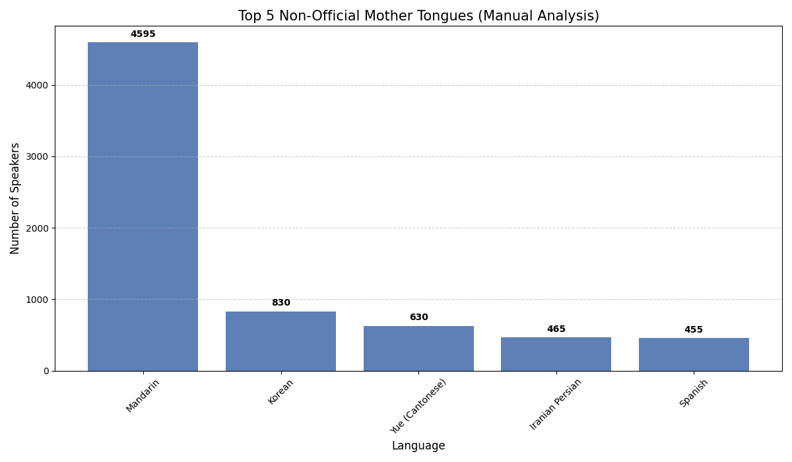
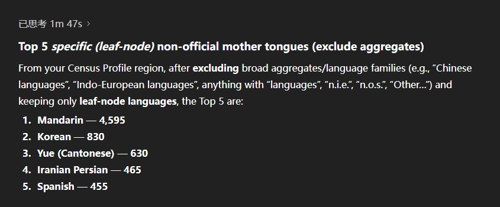
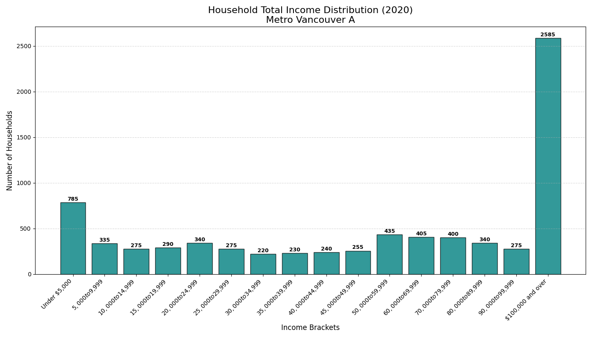
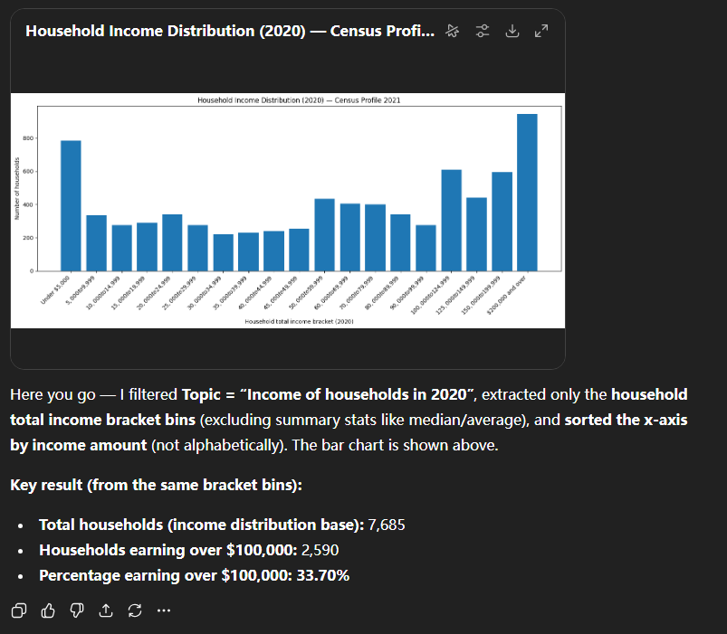

# Man vs. Machine: Census Data Analysis Experiment

## Project Overview

This repository contains the source code and experimental results for a comparative study: **Manual Python Analysis vs. AI-Generated Analysis**.

The objective of this project is to evaluate the reliability of Generative AI (LLMs) in performing data analysis tasks on unstructured or "messy" government open data. We utilized the **2021 Census Profile for Metro Vancouver** to perform specific data extraction and visualization tasks.

The experiment tests the hypothesis that while AI agents are efficient at generating code, they often lack the contextual understanding required to handle data anomalies without human supervision.

## Data Source

* **Dataset:** Census Profile, 2021 Census of Population.
* **Region:** Metro Vancouver A, Regional district electoral area (British Columbia).
* **Source:** Statistics Canada.
* **File Location:** `data/CensusProfile2021-ProfilRecensement2021-20260205015247.csv`

## Methodology & Results

We conducted two distinct analysis tasks using both a human-supervised manual approach (Python/Pandas) and an autonomous AI agent approach.

### Task 1: Non-Official Language Analysis
**Goal:** Identify and visualize the top 5 non-official mother tongues in the region.
**Challenge:** The raw data contains invisible trailing whitespace and hierarchical aggregate categories that must be filtered out to avoid double-counting.

**Result (Manual Analysis):**
Successfully identified specific languages (Mandarin, Korean, Cantonese) by stripping whitespace and excluding broad language families.



**Result (AI Analysis (Autonomous Agent(chatGPT))):**


---

### Task 2: Income Distribution Analysis (The Experiment)
**Goal:** Visualize the Household Total Income distribution for 2020.
**Challenge:** The dataset contains a structural anomaly where income brackets are listed twice: once for "Total Income" (pre-tax) and once for "After-tax Income".

#### Comparative Results

| Manual Analysis (Human-Supervised) | AI Analysis (Autonomous Agent(chatGPT)) |
| :---: | :---: |
|  |  |
| **Status: Correct** | **Status: Failed** |
| **Logic:** Explicitly deduplicated rows based on context (Total vs. After-tax). | **Logic:** Trusted explicit row labels without verifying duplicates. |
| **Outcome:** Accurate household count. | **Outcome:** Double-counted every household (100% inflation). |

**AI Analysis**


**Conclusion:** The AI agent failed to detect the duplicate labels, demonstrating that high-stakes data analysis still requires Human-in-the-Loop (HITL) validation.

## Repository Structure

```text
.
├── data/
│   └── CensusProfile2021-ProfilRecensement2021-20260205015247.csv
├── results/
│   ├── income_distribution.png     <-- Output from script 02
│   ├── top5_languages.png          <-- Output from script 01
│   └── ai_income_failed.png        <-- Saved output from AI Chat
├── src/
│   ├── 01_language_analysis.py
│   └── 02_income_distribution.py
├── .gitignore
├── README.md
└── requirements.txt